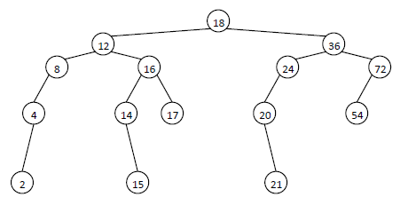

## Binary Search Trees Topology Groups
This project is a programming assignment in C which aims at developing an algorithm that
builds a binary search tree (BST) from a given sequence and attempts to find other sequences that yield the same BST topology group.

#### Check If It Has Same Topology Group
Traverse tree and store number of childs for every node and multiply by depth of that node, if it is same for the second tree (sequence is not important) then it has same bst topology group.
#### Algorithm For Finding All Possible BST Topology Groups
First of all different all possible sequences requires permutation algorithm. I used Heap’s Algorithm for generating permutations. Because it is the best way of generate those numbers. When one single permutation is created by algorithm, a temporary tree is constructed by that permutation sequence. If that tree has same topology group with main tree, then count is increased by one. And then temporary tree is removed from heap temporarily.
