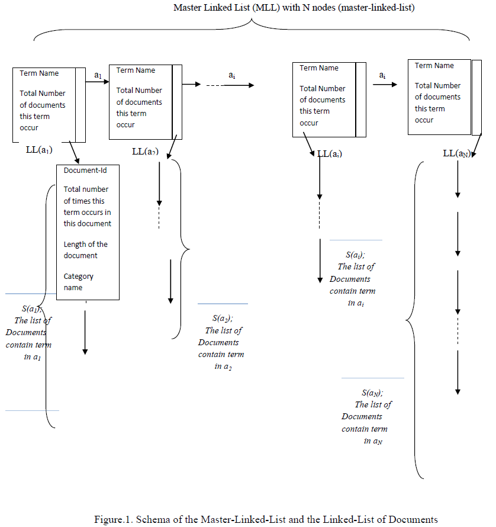

# Text Representation with bag-of-words (Bow) Approach
## Scope
Traditional representation methodology of documents in the literature is called Bag of Words
(BOW) feature representation. This representation symbolizes the terms and their
corresponding frequencies in a document and it is also named as Vector Space Model (VSM).
Each of these terms in the same document represents an independent dimension in a vector
space [1]. The order of words in the sentences is completely lost in bag representation like in
sets. This approach mainly emphasizes the frequency of terms. The BOW methodology makes the representation of words simpler in documents; still; it has several problems. One of
them is sparse vector representation. This makes the computation expensive especially for real
world scenarios, which include big data in textual domains. To address this problem; this
project aims to create more a more efficient representation of BOW model by using Linked-
Lists. Consequently, this project is a programming assignment in C, which aims to build an
algorithm based on linked-lists that will build an efficient representation of documents.
Our program opens and reads text files under the following directories: sport, magazine and health. These are 3 categories of 1150Haber dataset [2]. The number of documents in these categories will be arbitrary. Furthermore, the number of terms in these documents will also be arbitrary. In other words, the length of these files will be arbitrary.
## Functional Requirements
Our program reads all the documents under all the categories. Then we build a Master Linked-List (MLL). Each node in this MLL needs to represent a different term in these documents. All the terms in these documents are expected to be in the MLL. There will be cases, the same word occur in different documents, or in the same document. Then, we do not add a term into the MLL if it already exists. This list is in ascending order. Each record in MLL has 2 pointers: The first of them is for the next record in MLL. The second of them is for the starting record of another Linked-List. This sub Linked-List will represent the documents that contain the term in this record of MLL. Figure-1 shows the structure of MLL.

