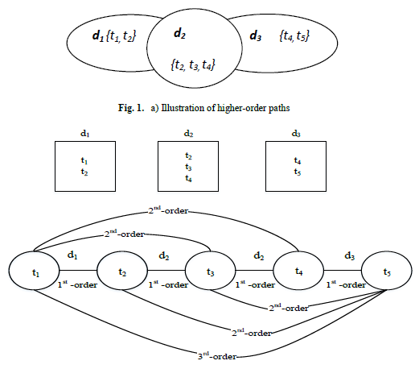

# Text representation with Higher-Order Paths
## Scope
Advantages of using higher-order paths [1] between documents are illustrated in Fig. 1. In
this figure, there are three documents, d1, d2 and d3 which include a set of terms {t1, t2, t3}, {t3,
t4, t5} and {t4, t5} respectively. Using a traditional similarity measure which is based on the
shared terms (e.g. dot product), similarity value between documents d1 and d3 will be zero
since they do not share any terms. But in fact these two documents have some similarities in
the context of the dataset through d2 as it can be seen in Fig. 1. This supports the idea that using higher-order paths between documents, it is possible to obtain a non-zero similarity value between d1 and d3 which was not possible in traditional Bag of Words (BOW) [2]
representation. This value becomes larger if there are many interconnecting documents like d2
between d1 and d3. This may stem from the reason that the two documents are written on the
same topic using two different but semantically closer sets of terms. This project aims to represent these higher-order paths by using Linked-Lists. Consequently, this project is a programming assignment in C, which aims to build an algorithm based on linked-lists that will build an efficient representation of documents.

1st-order term co-occurrence {t1, t2}, {t2, t3}, {t3, t4}, {t2, t4}, {t4, t5}
2nd-order term co-occurrence {t1, t3}, {t1, t4}, {t2, t5}, {t3, t5}
3rd-order term co-occurrence {t1, t5}
Fig. 2. b) Graphical demonstration of first-order, second-order and third-order paths between terms through documents

# Use Cases 
Our program opens and reads text files under the following directories: sport, magazine and health. These are 3 categories of 1150Haber dataset [3]. The number of documents in these categories will be arbitrary. Furthermore, the number of terms in these documents will also be arbitrary. In other words, the length of these files will be arbitrary. Our program is expected to do the followings:
a) (60 points) It reads all the documents under all the categories. Then program builds a Linked-List (MLL). Each node in this MLL needs to represent a different term in these documents. All the terms in these documents are in the MLL. After reading and storing all your data into Linked list, program finds 1st, 2nd and 3rd order term co-occurrences as shown below.
1st-order term co-occurrence {t1, t2}, {t2, t3}, {t3, t4}, {t2, t4}, {t4, t5}
2nd-order term co-occurrence {t1, t3}, {t1, t4}, {t2, t5}, {t3, t5}
3rd-order term co-occurrence {t1, t5}

Output: Our program will output following information:
Most frequent 10 words in the input set of documents, sorted descending by their term
frequency (tf) coupled with their tf values (comma seperated format, example: car;7)
c) (20 points)
Output: Most frequent 10 words in the input set of documents, sorted descending by their
term frequency*inverse document frequency (idf) coupled with their tf-idf values (comma
seperated format, example: car;2.8)
IDF (t) =log e N/n
N: Total number of documents
n: Number of documents with term t in it.
