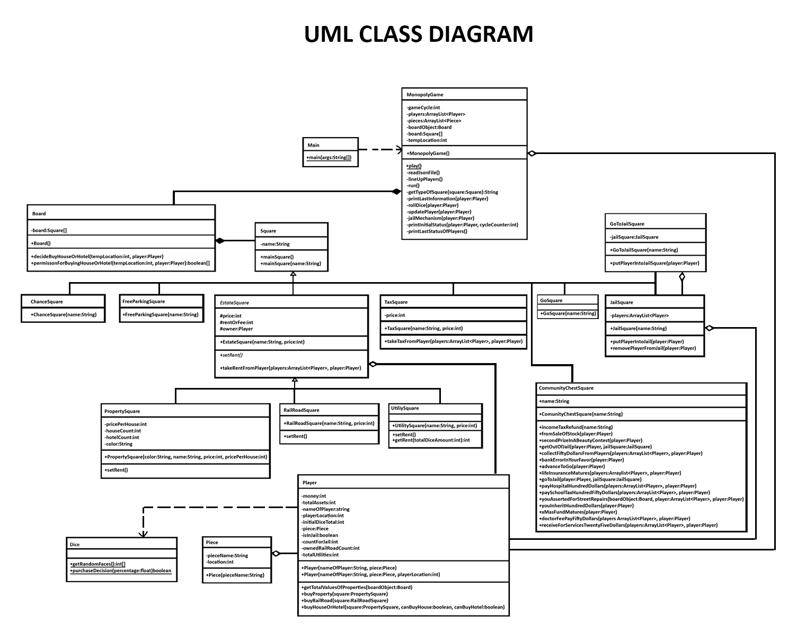
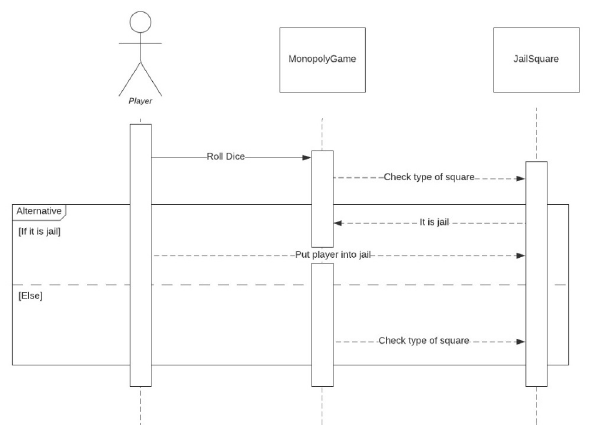
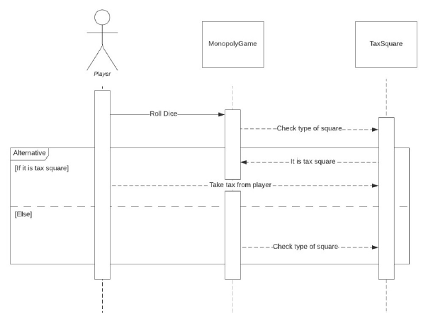
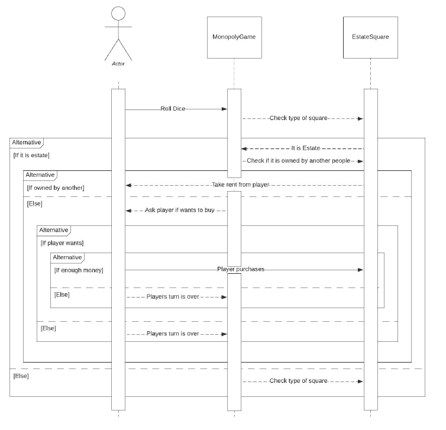
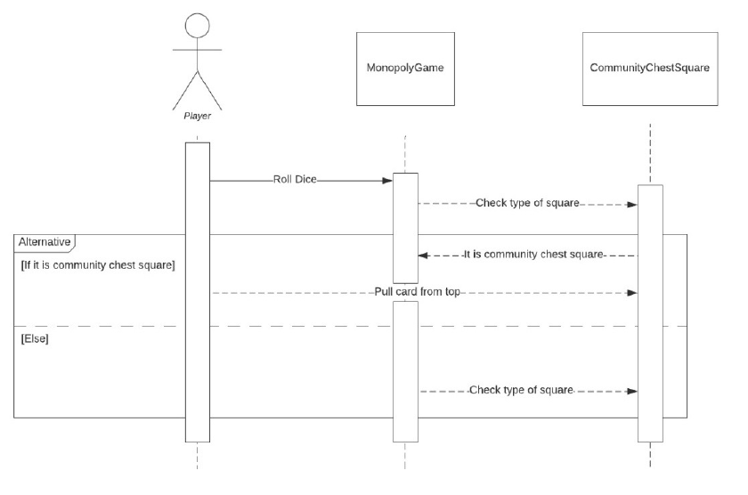

## MONOPOLY GAME

### Requirement Analysis
#### Purpose
This is a Requirements Analysis Document for a monopoly game. Monopoly is a common game all
around the world. This document describes the background, scope, functional and non-functional
requirements.
### Background
Monopoly is the best-selling commercial board game in the world. Players compete to acquire
wealth through stylized economic activity involving the buying, rental and trading of properties using
play money, as players take turns moving around the board according to the roll of the dice. The
game named after the economic concept of monopoly, the domination of a market by a single seller.
According to Hasbro, since Charles Darrow patented the game in 1935, approximately 750 million
people have played the game, making it "the most played [commercial] board game in the world."
The 1999 Guinness Book of Records cited Hasbro's previous statistic of 500 million people having
played Monopoly. Games Magazine has inducted Monopoly into its Hall of Fame.
#### Scope
Monopoly is a game in which players take turns squares on a two dimensional board. But at first
iteration there would not be user interface and information will be printed to console. Number of
bots (players) will be determined by runner of game project.
#### Functional Requirements
The game must be playable by 2-8 players simultaneously.
Each player has to roll dice at first to determine turn of players.
When player locate property square, that player can decide to purchase property, house or hotel.
If player locate other players property, owned player can take rent or fee from that player.
When player locate tax square, that square takes tax from player.
If player locate railroad square, player can purchase that railroad.
When player locate jail, it has to wait until everyone turns 3 times.
Game ends after there is only one player left.
#### Nonfunctional Requirements
Each player must have unique piece representation.
Each player must have unique name.
### UML CLASS DIAGRAM

### CLASS SEQUENCE DIAGRAM

