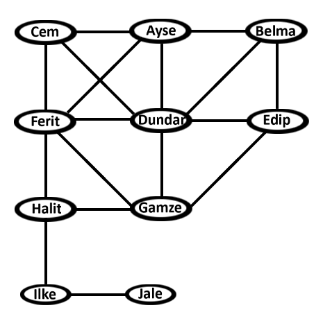

## Social Graphs

# Opinion About Graph
When we look at social graph above, we see that different people with various friendships. That situation makes people to investigate the most powerful person in that social graph. There are different kind of methods to find that person.
# Degree Centrality
The highest scored person is Dundar with point 0.6667 (standardized). Degree centrality is good for for finding most popular person in social graph. Dundar has 6 friends and that assumption corrects this situation.
# Closeness Centrality
The highest scored person is Ferit with point 0.6429 (standardized). Such people might have better access to information at other vertices or more direct influence on other vertices. And when we look at the position of node Ferit, that node has better access to other nodes.
# Betweenness Centrality
The highest scored person is Halit with point 0.0175 (standardized). Betweenness centrality finds wide application in network theory: it represents the degree of which nodes stand between each other. For example, in a telecommunications network, a node with higher betweenness centrality would have more control over the network, because more information will pass through that node. For example Ferit has better control over other nodes.
# Most Powerful Node
People utilize different kind of methods like degree, betweenness, closeness, eigen vector… to find most important node. In my method, we can find most important one by taking average of degree, betweenness(taking normal score), closeness centrality of graph. Dundar has highest average. 
# Is a Centralized Graph?
No, it is a distributed graph. Because social graphs like twitter, facebook are distributed. But even in facebook or twitter, there are lots of people that has only one friend like jale. So it does not mean that if there are people who has only one friend in a specific graph, that graph is not distributed.
